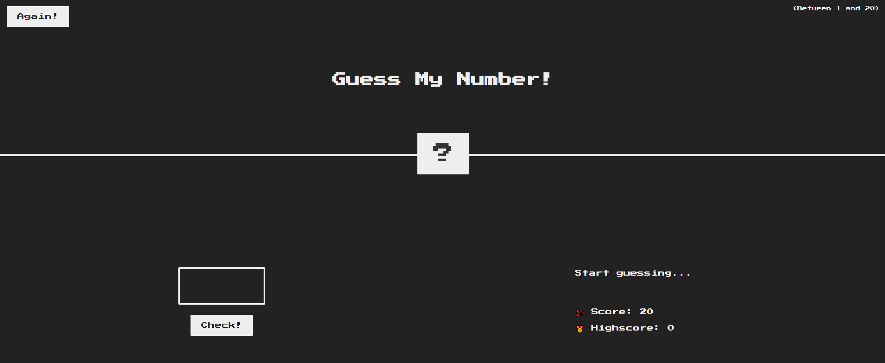

# Guess my number ! :rocket:

This is a vanilla js game with some assets for practicing DOM and Events Fundamentals.

## Rule
**Goal : Guess the right number and try to hit a high score ! :checkered_flag:**
1. Guess a number between **1 and 20** and press the **"Check!"** button to validate.
2. To reset the game press the **"Again!"** button.

## Usage :computer:
1. Simply download the entire repository as a zip folder and extract to a location of your liking.
2. Open the html file, voilà !

To consult the code you can simply click on the files in question.

## Contributing :hammer_and_wrench:

Do a pull request on the directory where I will review the changes before merge.

* Pull requests are welcome. For major changes, please open an 'issue' first to discuss what you want to change.

For more information on how to perform a pull request see the link [here](https://opensource.com/article/19/7/create-pull-request-github).

## License
[MIT](https://choosealicense.com/licenses/mit/)
